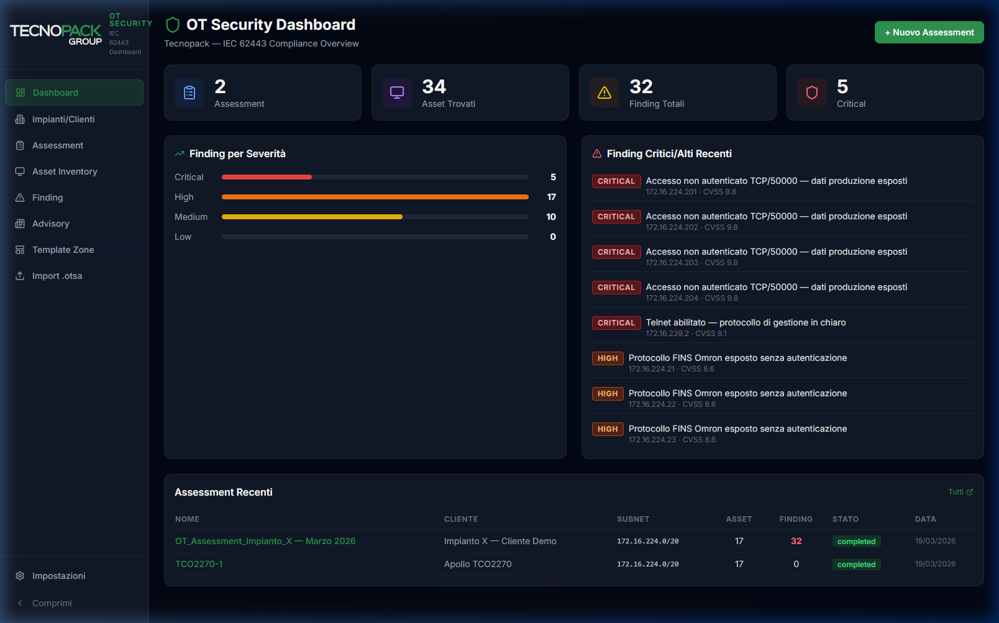

# Tecnopack OT Security Dashboard v2.0



A comprehensive OT Security Dashboard designed for **IEC 62443** compliance monitoring and multi-plant assessment management. Specifically tailored for Industrial Control Systems (ICS) and Operational Technology (OT) environments.

## 🚀 Key Features

-   **Multi-Plant Management**: Track security assessments across different industrial sites (e.g., Apollo TCO2270).
-   **Asset Inventory**: Real-time visibility into OT assets, subnets, and vendor-specific hardware (Omron, B&R, Siemens, etc.).
-   **Security Findings**: Automated and manual mapping of vulnerabilities with CVSS 3.1 scoring.
-   **Advisory Feed**: Integrated security advisories from CISA KEV and NVD specific to industrial vendors.
-   **Compliance**: Built-in support for IEC 62443 standard requirements.
-   **Reporting**: Export detailed security reports in PDF and Excel formats.

## 🛠 Tech Stack

-   **Frontend**: React, Vite, Tailwind CSS, Lucide Icons, Socket.io-client.
-   **Backend**: Node.js, Express, Better-SQLite3, WebSocket, Puppeteer (for PDF generation).
-   **Database**: SQLite (Self-contained, no external setup required).

## 🚦 Getting Started

### Prerequisites

-   Node.js (v18+)
-   NPM

### Installation & Launch

The project includes a convenient startup script that initializes the database, installs dependencies, and starts both backend and frontend services.

1.  **Clone the repository** (or navigate to the project directory).
2.  **Make the script executable**:
    ```bash
    chmod +x start.sh
    ```
3.  **Run the dashboard**:
    ```bash
    ./start.sh
    ```

### Accessing the Dashboard

Once started, the dashboard is accessible at:
-   **Frontend**: `http://localhost:3000`
-   **Backend API**: `http://localhost:3001`

*(In a networked environment, use the IP shown in the terminal output, e.g., `http://172.16.224.250:3000`)*

## 🔐 Configuration

Create a `.env` file in the `backend/` directory to configure environment variables:

```env
GITHUB_TOKEN=your_github_token_here
PORT=3001
```

## 📄 License

This project is licensed under the MIT License - see the [LICENSE](https://github.com/DFFM-maker/DashboardIEC62443/blob/main/LICENSE) for details.

---
Developed for **Tecnopack Group** — *Industrial OT Security Excellence.*
